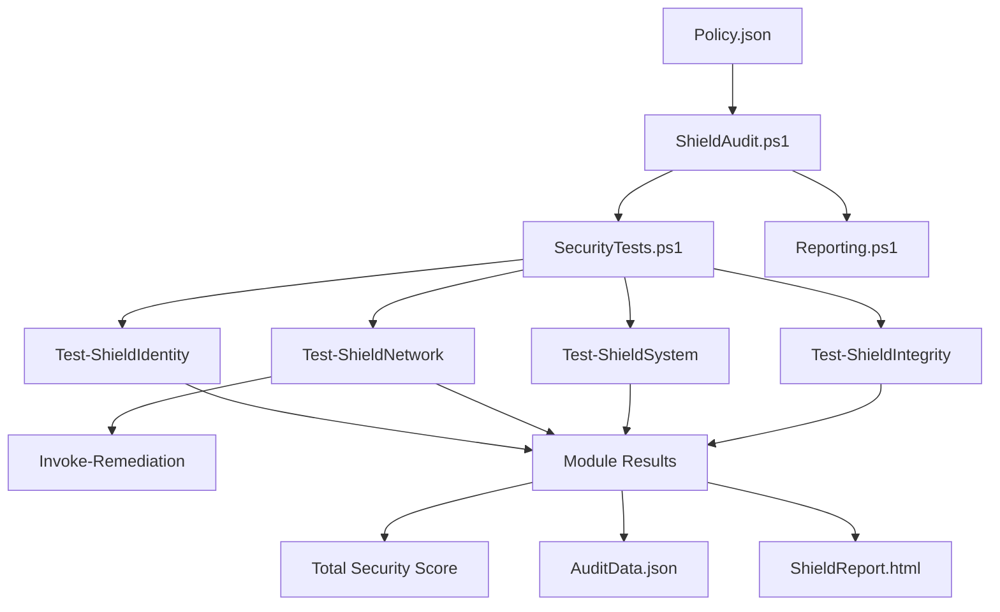
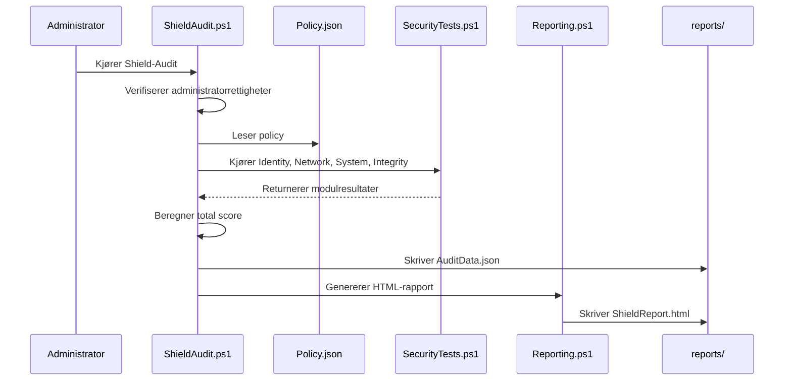
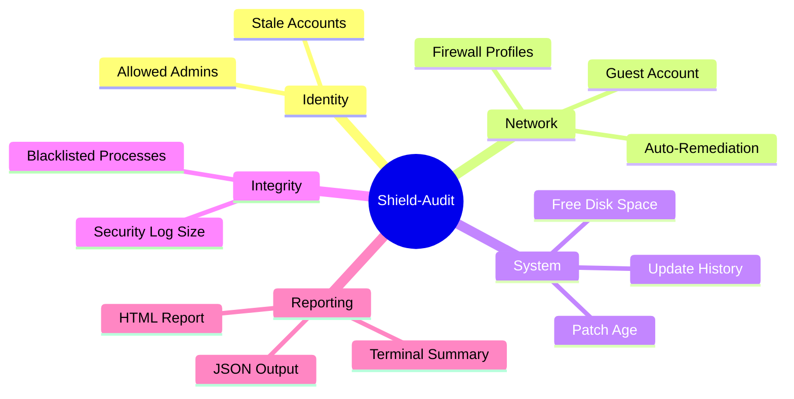
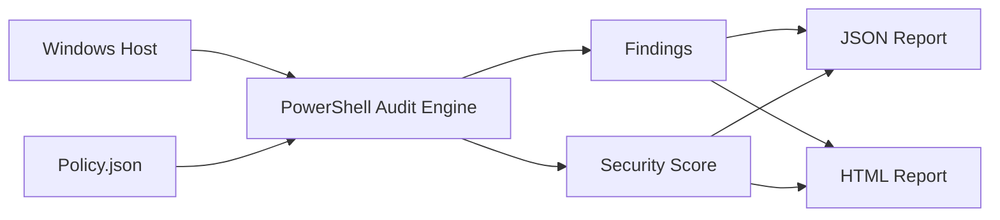

# Shield-Audit

**Automated Security Compliance & Hardening Tool for Windows**

Shield-Audit er et ferdigstilt PowerShell-basert rammeverk for automatisert sikkerhetsrevisjon, compliance-kontroll og hardening av Windows-maskiner og servere. Løsningen sammenligner systemets faktiske tilstand mot en definert policy, identifiserer sikkerhetsavvik, beregner en samlet Security Score og kan utføre automatisk utbedring der policyen tillater det.

Prosjektet er bygget for praktisk drift: rask lokal kjøring, lav kompleksitet, tydelig rapportering og en arkitektur som er enkel å utvide med flere sikkerhetskontroller.

## Status

- **Plattform:** Windows / PowerShell
- **Konfigurasjonsmodell:** Policy-as-Code via JSON
- **Rapporter:** JSON og HTML

## Innhold

- [Hva Shield-Audit gjør](#hva-shield-audit-gjor)
- [Kjernefunksjoner](#kjernefunksjoner)
- [Arkitektur](#arkitektur)
- [Prosjektstruktur](#prosjektstruktur)
- [Kjøreflyt](#kjøreflyt)
- [Policy-modell](#policy-modell)
- [Demo](#demo)
- [Eksempel pa rapport](#eksempel-pa-rapport)
- [Visualiseringer](#visualiseringer)
- [Tekniske valg](#tekniske-valg)
- [Utvidelser og videre arbeid](#utvidelser-og-videre-arbeid)

## Hva Shield-Audit gjør

Shield-Audit er laget for å besvare et enkelt operativt spørsmål: **Er denne Windows-maskinen i samsvar med definert sikkerhetspolicy akkurat nå?**

Verktøyet gjør dette ved å:

1. Lese ønsket sikkerhetstilstand fra en policyfil.
2. Samle inn sanntidsdata fra systemet.
3. Evaluere avvik innen identitet, nettverk, system og integritet.
4. Beregne en totalscore basert på modulresultater.
5. Generere rapporter som kan brukes i drift, dokumentasjon eller videre integrasjon.
6. Utføre remediations når policy tillater det.

## Kjernefunksjoner

### Identity & Privilege Audit

- Validerer medlemmer i Administrators-gruppen mot definert hvitliste.
- Oppdager uautoriserte administrative brukere.
- Identifiserer inaktive lokale brukere basert på siste pålogging.

### Network Hardening

- Kontrollerer at Windows Firewall-profiler er aktivert.
- Verifiserer at gjestekonto er deaktivert når policy krever det.
- Kan automatisk aktivere firewall eller deaktivere Guest-konto.

### System Compliance

- Kontrollerer tilgjengelig diskplass på systemdisken.
- Leser Windows Update-historikk.
- Varsler dersom systemet ikke er oppdatert innen policygrensen.

### Integrity Checks

- Skanner kjørende prosesser mot en blacklist.
- Kontrollerer at Security Event Log har minimumsstørrelse.

### Security Scoring

- Hver modul starter på score 100.
- Poeng trekkes ved funn og avvik.
- Total Security Score beregnes som avrundet gjennomsnitt av modulscorene.

### Structured Reporting

- Skriver maskinlesbar JSON-data til rapportmappen.
- Genererer HTML-rapport for rask visuell gjennomgang.
- Repositoryet inneholder også et eksempel på full revisjonsrapport i JSON.

## Arkitektur

Shield-Audit følger en enkel og tydelig policydrevet arkitektur:

- **Policy-lag:** Definerer forventet sikkerhetstilstand.
- **Orkestreringslag:** Validerer administratorrettigheter, laster moduler og styrer revisjonsløpet.
- **Kontrollmoduler:** Utfører de faktiske sikkerhetstestene.
- **Remediation-lag:** Utfører korrigerende tiltak når policy tillater det.
- **Rapportlag:** Genererer JSON- og HTML-rapporter.

### Arkitekturdiagram



## Prosjektstruktur

```text
Shield-Audit/
├── config/
│   └── Policy.json
├── reports/
│   └── FullAuditReport.json
├── src/
│   ├── ShieldAudit.ps1
│   └── lib/
│       ├── SecurityTests.ps1
│       └── Reporting.ps1
└── README.md
```

### Filansvar

- **config/Policy.json**
  Kilden til sannhet for tillatte administratorer, inaktive brukere, nettverkskrav og systemkrav.

- **src/ShieldAudit.ps1**
  Hovedmotoren. Sjekker administratorrettigheter, laster moduler, kjører alle kontroller, beregner totalscore og skriver rapporter.

- **src/Lib/SecurityTests.ps1**
  Inneholder fire dedikerte kontrollmoduler: Identity, Network, System og Integrity.

- **src/Lib/Reporting.ps1**
  Genererer visuell HTML-rapport basert på modulresultatene.

- **reports/FullAuditReport.json**
  Eksempel på full auditrapport med totalscore, modulscorer og findings.

## Kjøreflyt

### Revisjonssekvens



### Kontrollflyt i hovedmotoren

1. Administrator-sjekk ved oppstart.
2. Innlasting av biblioteker via dot sourcing.
3. Validering og parsing av policyfil.
4. Kjøring av alle sikkerhetsmoduler.
5. Eventuell remediationslogikk for nettverksavvik.
6. Beregning av totalscore.
7. Generering av rapportartefakter.
8. Oppsummering av funn i terminal.

## Policy-modell

Shield-Audit bruker en enkel JSON-basert policystruktur som gjør det lett å flytte samme verktøy mellom ulike maskiner eller roller.

### Gjeldende policyområder

- **IdentityPolicy**
  Tillatte administratorer og grense for inaktive kontoer.

- **NetworkPolicy**
  Krav om aktiv firewall, blokkering av gjestetilgang og styring av auto-remediation.

- **SystemPolicy**
  Minimum ledig diskplass, oppdateringskrav, svartelistede prosesser og minimumsstørrelse på sikkerhetslogg.

### Eksempel

```json
{
  "IdentityPolicy": {
    "AllowedAdmins": [
      "Administrator",
      "AzureAD\\DinBruker",
      "SystemAdmin"
    ],
    "MaxInactiveDays": 90
  },
  "NetworkPolicy": {
    "FirewallRequired": true,
    "BlockGuestAccess": true,
    "AutoRemediate": false
  },
  "SystemPolicy": {
    "MinFreeDiskGB": 10,
    "RequireWindowsUpdate": true,
    "MaxDaysSinceLastUpdate": 30,
    "BlacklistedProcesses": ["wireshark", "utorrent", "anydesk"],
    "MinSecurityLogSizeMB": 128
  }
}
```

## Demo

### Krav

- Windows-maskin
- PowerShell med tilgang til lokale sikkerhetskommandoer
- Kjøring som Administrator

### Kjøring

```powershell
.\src\ShieldAudit.ps1
```

### Forventet terminalflyt

```text
Shield-Audit starter full systemgjennomgang...

[1] Analyserer Identiteter og Tilgang...
[2] Analyserer Nettverkshardening & Gjestetilgang...
[3] Analyserer System & Patch Compliance...
[4] Analyserer Systemintegritet og Prosesser...

-------------------------------------------
SHIELD-AUDIT FULLFØRT: 2026-04-08 12:34
TOTAL SECURITY SCORE: 79 / 100
```

### Rapportartefakter

Etter kjøring produserer løsningen rapportdata i rapportmappen:

- **AuditData.json** for videre behandling og historikk
- **ShieldReport.html** for visuell presentasjon
- Repositoryet inneholder i tillegg **FullAuditReport.json** som eksempel på full strukturert rapport

## Eksempel på rapport

Repositoryet inneholder et eksempel på en fullført rapport med totalscore og modulresultater. Utdrag:

```json
{
  "Timestamp": "2026-04-08 12:34",
  "TotalScore": 79,
  "AutoRemediateEnabled": false,
  "Modules": [
    {
      "Module": "Identity",
      "Score": 50,
      "Findings": [
        "UNAUTHORIZED ADMIN: Brukeren 'LAPTOP-J5PN6RL1\\Administrator' har admin-rettigheter, men er ikke i hvitlisten.",
        "UNAUTHORIZED ADMIN: Brukeren 'LAPTOP-J5PN6RL1\\heyit' har admin-rettigheter, men er ikke i hvitlisten.",
        "STALE ACCOUNT: 'Carpe Diem' har ikke logget inn siden 08/27/2024 12:23:46. Risiko for misbruk."
      ]
    },
    {
      "Module": "Network",
      "Score": 100,
      "Findings": []
    }
  ]
}
```

### Hvordan lese resultatet

- **80-100:** Høy grad av compliance.
- **60-79:** Moderat risiko eller flere avvik som bør lukkes.
- **0-59:** Kritisk nivå med tydelige sikkerhetsbrudd eller manglende kontrollgrunnlag.

## Visualiseringer

### Moduloversikt



### Dataflyt



## Tekniske valg

- **PowerShell-first design**
  Valgt for direkte tilgang til Windows API-er, lokale brukere, firewallprofiler, event logs og oppdateringshistorikk.

- **Policy-as-Code**
  Konfigurasjon er skilt fra kontrollogikk, som gjør løsningen enklere å vedlikeholde og tilpasse.

- **Modulær oppbygning**
  Nye kontroller kan legges inn som egne testfunksjoner uten å endre hovedflyten vesentlig.

- **Desired State-tankegang**
  Verktøyet vurderer ikke bare avvik, men kan også tvinge systemet tilbake til definert sikker tilstand der dette er ønsket.

- **Rapportering for drift og ledelse**
  JSON dekker teknisk integrasjon; HTML dekker menneskelig lesbar presentasjon.

## Utvidelser og videre arbeid

Selv om prosjektet er ferdigstilt i nåværende versjon, er arkitekturen bygget for videre utvidelse. Naturlige neste steg er:

- Patch management-modul med dypere validering av manglende sikkerhetsoppdateringer.
- Analyse av hendelseslogger for brute force-forsøk og avvikende påloggingsmønstre.
- Videreutvikling av dashboard- og historikkvisning.
- Integrasjon mot øvrige verktøy i en samlet Admin Suite.

## Oppsummering

Shield-Audit er en ferdig policydrevet sikkerhetsmotor for Windows som kombinerer revisjon, scoring, rapportering og målrettet remediation i ett lettvekts rammeverk. Resultatet er et verktøy som er enkelt å kjøre operativt, lett å forstå arkitektonisk og klart for videre utvidelse.